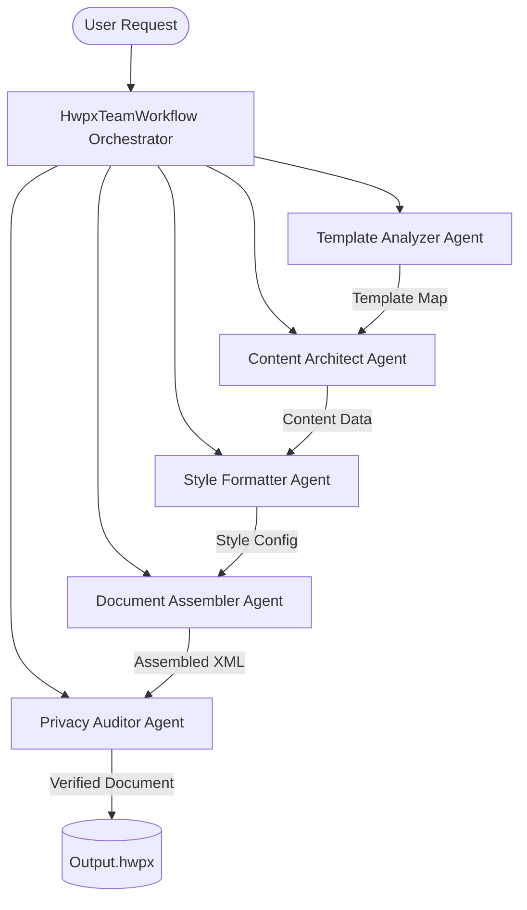

# hwpxskill

> HWPX Document Engine & Multi-Agent Swarm Workflows

A powerful engine for analyzing, editing, generating, and packing HWPX files, supercharged by a multi-agent AI swarm.

## Architecture

The project employs a 5-Agent Swarm architecture to orchestrate document generation and modification.



## Installation

```bash
pip install hwpxskill
```

## Features

- **Analyze**: Extract template structure, tables, and existing styles.
- **Fill & Edit**: Inject JSON data directly into specific cell coordinates.
- **Format**: Apply granular styles (fonts, backgrounds, borders) dynamically.
- **Audit**: Perform privacy scrubbing (PII redaction) and integrity validation.

## Quick Start (CLI)

```bash
# 1. Analyze an existing HWPX file
hwpxskill analyze input.hwpx

# 2. Fill the file with data
hwpxskill fill input.hwpx output.hwpx --data data.json

# 3. Format tables
hwpxskill format-table input.hwpx output.hwpx --config style.json

# 4. Audit for privacy issues
hwpxskill audit output.hwpx

# 5. Run the entire Multi-Agent workflow
hwpxskill team-run template.hwpx final.hwpx --instruction "Create a polished report" --data data.json
```

## Security & Privacy Policy
This framework includes a dedicated **Privacy Auditor Agent** which runs comprehensive checks across the generated document to detect and block the release of Personally Identifiable Information (PII) or other unauthorized sensitive data. 

## License
MIT License. See [LICENSE](LICENSE) for details.
